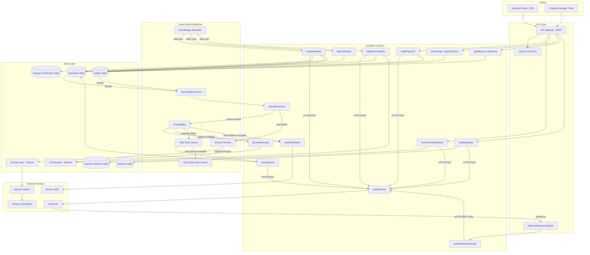

# SFR3 Payment System -- Architecture Document

> Technical design for a production-ready payment system handling rent collection, deposits, fees, and financial reporting for 10,500+ single-family rental homes across 20 states.

---

## Table of Contents

1. [Overview](#1-overview)
2. [Technology Stack](#2-technology-stack)
3. [System Architecture](#3-system-architecture)
4. [Data Model](#4-data-model)
5. [Event Sourcing -- Ledger Design](#5-event-sourcing----ledger-design)
6. [Service Components](#6-service-components)
7. [Key Flows](#7-key-flows)
8. [Payment Provider Integration](#8-payment-provider-integration)
9. [Analytics Pipeline](#9-analytics-pipeline)
10. [Monitoring and Alerting](#10-monitoring-and-alerting)
11. [Reliability and Error Handling](#11-reliability-and-error-handling)
12. [Audit Trail and Data Retention](#12-audit-trail-and-data-retention)
13. [Release Plan](#13-release-plan)
14. [Project Structure](#14-project-structure)

---

## 1. Overview

### Problem

SFR3 needs a centralized payment system that:

- Accepts initial deposits to hold homes before move-in
- Collects monthly rent from 10,000+ residents
- Handles late fees, utility charges, and other one-time/recurring charges
- Supports multiple payment methods (ACH, credit/debit cards, digital wallets)
- Manages payment failures, retries, chargebacks, and disputes
- Provides financial reporting, reconciliation, and operational monitoring

### Design Principles

- **Event-sourced ledger**: every financial mutation is an immutable event; current state is derived, never overwritten
- **Serverless-first**: no servers to manage, pay-per-use, automatic scaling
- **Event-driven**: services communicate through domain events, decoupled via EventBridge
- **Observability from day one**: analytics pipeline is foundational, not an afterthought

### Personas

| Persona | Role |
|---|---|
| Resident | Tenant who makes payments |
| Property Manager | SFR3 staff who manages properties and resident accounts |
| Finance Analyst | SFR3 staff responsible for reconciliation and reporting |

---

## 2. Technology Stack

| Layer | Technology | Rationale |
|---|---|---|
| IaC / Deployment | Serverless Framework | Single-project deployment, mature DynamoDB/Lambda/API GW support |
| Runtime | TypeScript on AWS Lambda | Type safety for financial logic, strong Stripe/AWS SDK support |
| API | API Gateway (REST) | Request routing, throttling, authorization integration |
| Auth | Amazon Cognito | Managed auth with separate user pools for residents and staff |
| Database | Amazon DynamoDB | Serverless, single-digit-ms latency, DynamoDB Streams for event propagation |
| Event Bus | Amazon EventBridge | Loosely couples services via domain events, rule-based routing |
| Scheduling | EventBridge Scheduler | Daily sweep jobs (autopay, late fees, reconciliation) |
| Retry Queue | Amazon SQS + DLQ | Payment retry with configurable backoff, dead-letter for exhausted retries |
| Analytics | Kinesis Firehose + S3 + Athena | Event data lake with SQL query support |
| Dashboard | Amazon QuickSight | Finance team dashboards over Athena data |
| Notifications | Amazon SES | Transactional emails to residents |
| File Storage | Amazon S3 | Payment receipts (PDF), reconciliation reports |
| Payment Provider | Stripe | Payment processing, tokenization, chargeback lifecycle |
| Monitoring | CloudWatch Metrics + Alarms | Operational alerts, custom payment metrics |

---

## 3. System Architecture



---

## 4. Data Model

All tables live in a single DynamoDB instance. Access patterns are designed around the application's query needs.

### 4.1 Ledger Table (Event-Sourced)

Stores the full financial history for each resident as an append-only event log with periodic snapshots. See [Section 5](#5-event-sourcing----ledger-design) for details.

| Attribute | Key | Type | Description |
|---|---|---|---|
| `PK` | Partition Key | `S` | `RESIDENT#<residentId>` |
| `SK` | Sort Key | `S` | `v<version>` (zero-padded, e.g., `v00000001`) |
| `type` | -- | `S` | `EVENT` or `SNAPSHOT` |
| `eventType` | -- | `S` | `CHARGE_POSTED`, `PAYMENT_APPLIED`, `LATE_FEE_APPLIED`, `REFUND_APPLIED`, etc. |
| `amount` | -- | `N` | Positive for charges, negative for payments/credits |
| `balance` | -- | `N` | Only present on `SNAPSHOT` records |
| `chargeType` | -- | `S` | `RENT`, `DEPOSIT`, `UTILITY`, `LATE_FEE`, `OTHER` |
| `description` | -- | `S` | Human-readable description |
| `referenceId` | -- | `S` | Links to payment ID, charge ID, or dispute ID |
| `propertyId` | -- | `S` | Property identifier (for reporting) |
| `state` | -- | `S` | US state code (for reporting) |
| `timestamp` | -- | `S` | ISO 8601 timestamp |
| `ttl` | -- | `N` | Optional TTL for data retention policy |

### 4.2 Payments Table

| Attribute | Key | Type | Description |
|---|---|---|---|
| `PK` | Partition Key | `S` | `PAYMENT#<paymentId>` |
| `SK` | Sort Key | `S` | `METADATA` |
| `residentId` | GSI1-PK | `S` | Resident identifier |
| `createdAt` | GSI1-SK | `S` | ISO 8601 timestamp |
| `amount` | -- | `N` | Payment amount |
| `currency` | -- | `S` | `USD` |
| `status` | -- | `S` | `PENDING`, `SETTLED`, `FAILED`, `REFUNDED` |
| `paymentMethodId` | -- | `S` | Reference to payment method used |
| `paymentMethodType` | -- | `S` | `ACH`, `CARD`, `WALLET` |
| `stripePaymentIntentId` | -- | `S` | Stripe reference |
| `retryCount` | -- | `N` | Number of retry attempts |
| `maxRetries` | -- | `N` | Configurable max retries |
| `failureReason` | -- | `S` | Stripe decline code or error |
| `reconciledAt` | -- | `S` | Timestamp when matched during reconciliation |

**GSI1** (`residentId`, `createdAt`): supports "list payments by resident" sorted by date.

### 4.3 Payment Methods Table

| Attribute | Key | Type | Description |
|---|---|---|---|
| `PK` | Partition Key | `S` | `RESIDENT#<residentId>` |
| `SK` | Sort Key | `S` | `METHOD#<methodId>` |
| `type` | -- | `S` | `ACH`, `CARD`, `WALLET` |
| `stripePaymentMethodId` | -- | `S` | Stripe token (no raw card/account data) |
| `last4` | -- | `S` | Last 4 digits for display |
| `label` | -- | `S` | User-friendly name (e.g., "Chase checking") |
| `isDefault` | -- | `BOOL` | Default payment method flag |
| `createdAt` | -- | `S` | ISO 8601 timestamp |

### 4.4 Autopay Enrollments Table

| Attribute | Key | Type | Description |
|---|---|---|---|
| `PK` | Partition Key | `S` | `RESIDENT#<residentId>` |
| `SK` | Sort Key | `S` | `AUTOPAY` |
| `paymentMethodId` | -- | `S` | Enrolled payment method |
| `chargeDay` | GSI1-SK | `N` | Day of month (1-28) |
| `sweepGroup` | GSI1-PK | `S` | Fixed value `AUTOPAY_ACTIVE` |
| `status` | -- | `S` | `ACTIVE`, `PAUSED`, `CANCELLED` |
| `createdAt` | -- | `S` | ISO 8601 timestamp |

**GSI1** (`AUTOPAY_ACTIVE`, `chargeDay`): the daily sweep queries this GSI with `chargeDay = today` to find all enrollments due.

### 4.5 Disputes Table

| Attribute | Key | Type | Description |
|---|---|---|---|
| `PK` | Partition Key | `S` | `DISPUTE#<disputeId>` |
| `SK` | Sort Key | `S` | `METADATA` |
| `residentId` | -- | `S` | Resident identifier |
| `paymentId` | -- | `S` | Original payment reference |
| `stripeDisputeId` | -- | `S` | Stripe dispute reference |
| `status` | -- | `S` | `OPEN`, `UNDER_REVIEW`, `WON`, `LOST` |
| `amount` | -- | `N` | Disputed amount |
| `evidenceUrl` | -- | `S` | S3 URL for uploaded evidence |
| `createdAt` | -- | `S` | ISO 8601 timestamp |
| `resolvedAt` | -- | `S` | ISO 8601 timestamp |

---

## 5. Event Sourcing -- Ledger Design

The ledger follows the pattern described by [Yan Cui (The Burning Monk)](https://theburningmonk.com/2019/08/a-simple-event-sourcing-example-with-snapshots-using-lambda-and-dynamodb/), adapted for a resident financial ledger.

### 5.1 Core Concepts

**Events** are immutable facts: "a charge was posted", "a payment was applied", "a late fee was assessed". They are never updated or deleted.

**Snapshots** are periodic materialized views of the current state (balance and itemized outstanding charges). One snapshot is written for every N events (e.g., every 10).

**Current state** is rebuilt by finding the latest snapshot and folding forward through subsequent events.

### 5.2 How It Works

```
Resident r123 Ledger:

  SK       | type     | eventType        | amount  | balance
  ---------|----------|------------------|---------|--------
  v00000000| SNAPSHOT |                  |         | 0
  v00000001| EVENT    | CHARGE_POSTED    | +2100   |
  v00000002| EVENT    | CHARGE_POSTED    | +75     |
  v00000003| EVENT    | PAYMENT_APPLIED  | -2100   |
  v00000004| EVENT    | CHARGE_POSTED    | +50     |
  ...
  v00000010| SNAPSHOT |                  |         | 125
  v00000011| EVENT    | LATE_FEE_APPLIED | +50     |
  v00000012| EVENT    | PAYMENT_APPLIED  | -125    |
```

To get the current balance:

1. Query `PK = RESIDENT#r123`, `ScanIndexForward = false`, `Limit = 10`
2. Find the most recent `SNAPSHOT` in the results (v00000010, balance = 125)
3. Apply events after the snapshot: 125 + 50 - 125 = **50**

This guarantees a constant read cost of at most N+1 items per balance lookup, regardless of how many total events exist.

### 5.3 Optimistic Locking

Every write uses a DynamoDB condition expression:

```
ConditionExpression: "attribute_not_exists(SK)"
```

This prevents two concurrent operations from writing the same version number. If a conflict occurs, the operation is retried with the next available version. This protects against double-charges or double-credits.

### 5.4 Snapshot Strategy

After writing event version N, if `N % SNAPSHOT_INTERVAL === 0`:

1. Read current state (latest snapshot + subsequent events)
2. Write a `SNAPSHOT` record at version N with the computed balance and outstanding items

The snapshot write is a separate DynamoDB put that is idempotent (same version, same computed state).

### 5.5 Domain Events

| Event Type | Trigger | Amount Sign |
|---|---|---|
| `CHARGE_POSTED` | Property manager posts a charge | Positive |
| `PAYMENT_APPLIED` | Payment settles successfully | Negative |
| `LATE_FEE_APPLIED` | Grace period expires with outstanding balance | Positive |
| `REFUND_APPLIED` | Payment is refunded | Positive |
| `CHARGEBACK_APPLIED` | Dispute is lost, charge reinstated | Positive |
| `CREDIT_APPLIED` | Manual adjustment or correction | Negative |

---

## 6. Service Components

### 6.1 Lambda Functions

| Function | Trigger | Responsibility |
|---|---|---|
| `enrollPaymentMethod` | API Gateway | Link bank account or card via Stripe, store token |
| `makePayment` | API Gateway | Initiate a one-time payment via Stripe, write to Payments table |
| `postCharge` | API Gateway | Append a `CHARGE_POSTED` event to the Ledger table |
| `applyPayment` | Internal (webhook flow) | Append a `PAYMENT_APPLIED` event to the Ledger table |
| `getBalance` | API Gateway | Rebuild current balance from latest snapshot + events |
| `getHistory` | API Gateway | Query Payments table GSI1 for resident's payment list |
| `stripeWebhookHandler` | API Gateway (webhook endpoint) | Verify Stripe signature (via stripeService), update payment status, trigger ledger event |
| `stripeService` | HTTP POST (internal route) | Single point of access to Stripe API; all Stripe operations go through this Lambda via POST /internal/stripe |
| `streamProcessor` | DynamoDB Streams | Transform DynamoDB inserts into domain events, publish to EventBridge + Firehose |
| `autopaySweep` | EventBridge Scheduler (daily) | Query active autopay enrollments due today, initiate payments |
| `lateFeeSweep` | EventBridge Scheduler (daily) | Check overdue balances past grace period, post late fee events |
| `retryPayment` | SQS Retry Queue | Re-attempt a failed payment via Stripe |
| `dailyReconciliation` | EventBridge Scheduler (daily) | Match Stripe settlements against internal records, flag mismatches |
| `sendNotification` | EventBridge | Send transactional emails via SES |
| `generateReceipt` | EventBridge | Generate PDF receipt, store in S3 |
| `handleDispute` | API Gateway + EventBridge | Manage dispute lifecycle, submit evidence to Stripe |

### 6.2 Stream Processor -- The Event Backbone

The `streamProcessor` Lambda subscribes to DynamoDB Streams on both the Ledger and Payments tables. It is the central nervous system of the architecture:

1. **Receives** raw DynamoDB INSERT/MODIFY events
2. **Transforms** them into clean domain events with a stable schema
3. **Publishes** domain events to EventBridge for operational reactions (notifications, retries, receipt generation)
4. **Forwards** the same events to Kinesis Firehose for the analytics data lake

This follows the approach recommended in the Burning Monk article (option b) -- downstream consumers work with domain events, decoupled from DynamoDB internals.

### 6.3 Domain Event Schema

All domain events share a common envelope:

```typescript
interface DomainEvent {
  eventId: string;          // UUID
  eventType: string;        // e.g., "payment.settled", "charge.posted"
  source: string;           // e.g., "sfr3.payments", "sfr3.ledger"
  timestamp: string;        // ISO 8601
  version: string;          // schema version, e.g., "1.0"
  data: {
    residentId: string;
    propertyId: string;
    state: string;          // US state code
    amount: number;
    currency: string;
    paymentMethod?: string; // ACH, CARD, WALLET
    failureReason?: string;
    stripeRef?: string;     // Stripe payment intent or dispute ID
    [key: string]: unknown;
  };
}
```

This schema flows into both EventBridge (for routing rules) and Firehose/S3 (for Athena queries).

---

## 7. Key Flows

### 7.1 One-Time Payment (Stories 1, 2)

```
Resident -> API GW -> makePayment Lambda
  1. Rebuild ledger state; if balance <= 0 return 400 "No balance due"; if amount > balance return 400 "Amount exceeds current balance" with balance (partial payments supported: amount must be <= current balance)
  2. Validate payment method exists in Methods table
  3. Call stripeService (HTTP POST) to create payment intent
  4. Write to Payments table: status = PENDING, stripePaymentIntentId = pi_xxx
  5. Return 202 with paymentId, currentBalance, balanceAfterPayment

  ... Stripe processes asynchronously ...

  6. Stripe fires payment_intent.succeeded webhook -> API GW -> stripeWebhookHandler
  7. Verify Stripe signature (via stripeService)
  8. Update Payments table: status = SETTLED
  9. Append PAYMENT_APPLIED event to Ledger table (+ snapshot if due)
 10. DynamoDB Stream -> streamProcessor -> EventBridge
 11. EventBridge rules trigger:
     - sendNotification: email confirmation to resident
     - generateReceipt: PDF stored in S3
```

Partial payments are supported: the resident may send any amount (cents) not exceeding the current balance; amount is validated before creating the payment intent (no overpayment by default).

### 7.2 Post a Charge (Story 4)

```
Property Manager -> API GW -> postCharge Lambda
  1. Validate charge details (type, amount, due date)
  2. Read current ledger version (latest snapshot query)
  3. Append CHARGE_POSTED event to Ledger table with next version
  4. DynamoDB Stream -> streamProcessor -> EventBridge
  5. EventBridge -> sendNotification: email to resident about new charge
```

### 7.3 Daily Autopay Sweep (Story 3)

```
EventBridge Scheduler (daily 6am) -> autopaySweep Lambda
  1. Query Autopay table GSI1: sweepGroup = "AUTOPAY_ACTIVE", chargeDay = today
  2. For each active enrollment:
     a. Rebuild current balance from Ledger (snapshot + events)
     b. If balance > 0:
        - Call stripeService to create payment intent
        - Write to Payments table: status = PENDING
     c. If balance <= 0: skip (nothing owed)
  3. Publish autopay.sweep.complete event to EventBridge
```

### 7.4 Late Fee Assessment (Story 5)

```
EventBridge Scheduler (daily 11pm) -> lateFeeSweep Lambda
  1. Scan Ledger table for residents with outstanding RENT charges
     (using a GSI on chargeType + dueDate, or a dedicated tracking table)
  2. For each, check: dueDate + gracePeriodDays < today
  3. If overdue and no late fee already applied for this cycle:
     - Append LATE_FEE_APPLIED event to Ledger table
  4. DynamoDB Stream -> EventBridge -> sendNotification to resident
```

### 7.5 Payment Failure and Retry (Story 6)

```
Stripe fires payment_intent.payment_failed webhook -> stripeWebhookHandler
  1. Update Payments table: status = FAILED, increment retryCount, record failureReason
  2. DynamoDB Stream -> streamProcessor -> EventBridge
  3. EventBridge rule evaluates retryCount:
     - If retryCount < maxRetries:
       Route to SQS Retry Queue with delay = retryCount * baseDelay (e.g., 4h, 8h, 24h)
     - If retryCount >= maxRetries:
       Route to DLQ, publish payment.permanently_failed event
  4. SQS triggers retryPayment Lambda after delay:
     a. Read payment from Payments table
     b. Call stripeService to create payment intent with same payment method
     c. Write new attempt to Payments table
  5. DLQ depth > 0 -> CloudWatch Alarm -> alerts property manager
  6. Each failure -> sendNotification -> email to resident
```

### 7.6 Chargeback Handling (Story 7)

```
Stripe fires charge.dispute.created webhook -> stripeWebhookHandler
  1. Create record in Disputes table: status = OPEN
  2. Publish chargeback.received event to EventBridge
  3. EventBridge -> sendNotification: alert finance team

Finance Analyst responds via PM Portal -> API GW -> handleDispute Lambda
  4. Upload evidence to S3
  5. Submit evidence via stripeService
  6. Update Disputes table: status = UNDER_REVIEW

Stripe fires charge.dispute.closed webhook -> stripeWebhookHandler
  7. Update Disputes table: status = WON or LOST
  8. If LOST: append CHARGEBACK_APPLIED event to Ledger (charge reinstated)
  9. Publish dispute.resolved event to EventBridge
```

### 7.7 Daily Reconciliation (Story 8)

```
EventBridge Scheduler (daily 2am) -> dailyReconciliation Lambda
  1. Fetch Stripe balance transactions for previous day via stripeService
  2. Query Payments table for all SETTLED payments for previous day
  3. Match by stripePaymentIntentId:
     - Matched: update Payments table reconciledAt timestamp
     - Mismatched amount: flag in report
     - Missing from internal records: flag in report
     - Missing from Stripe: flag in report
  4. Write reconciliation report to S3
  5. Publish reconciliation.complete event to EventBridge
  6. If mismatches found -> CloudWatch Alarm -> alert finance team
```

---

## 8. Payment Provider Integration

### 8.1 Dedicated Stripe Service

Stripe access is centralized in a single **stripeService** Lambda. No other Lambda holds Stripe credentials or talks to the Stripe API directly. Other Lambdas call the Stripe service over **HTTP** (POST to `/internal/stripe` with body `{ action, params }`). The stripeService Lambda is exposed via API Gateway and is the only component that uses the Stripe SDK (via the Stripe adapter). Credentials (`STRIPE_SECRET_KEY`, `STRIPE_WEBHOOK_SECRET`) are scoped to this Lambda's environment (e.g. from SSM). A **stripeServiceClient** implements the same `PaymentProviderPort` interface by calling the stripeService HTTP endpoint, so business logic remains unchanged.

### 8.2 Stripe Adapter (inside stripeService only)

A thin adapter abstracts the Stripe SDK behind a port interface. It runs only inside the stripeService Lambda.

```typescript
// ports/paymentProvider.ts
export interface PaymentProviderPort {
  createCustomer(params: CreateCustomerParams): Promise<CustomerResult>;
  attachPaymentMethod(customerId: string, token: string): Promise<MethodResult>;
  detachPaymentMethod(paymentMethodId: string): Promise<void>;
  createPaymentIntent(params: PaymentIntentParams): Promise<PaymentIntentResult>;
  getBalanceTransactions(params: DateRangeParams): Promise<BalanceTransaction[]>;
  getPaymentIntent(paymentIntentId: string): Promise<{ status: string; amount: number } | null>;
  submitDisputeEvidence(disputeId: string, evidence: Evidence): Promise<void>;
  verifyWebhookSignature(payload: string, signature: string): Promise<boolean>;
}

// adapters/stripeAdapter.ts - used only by stripeService
// adapters/stripeServiceClient.ts - implements PaymentProviderPort via HTTP
```

### 8.3 ACH via Stripe

ACH bank account enrollment is handled via **Stripe ACH Direct Debit** (and Stripe Financial Connections where applicable). No separate bank-verification provider is used; the system is Stripe-only for payment methods.

### 8.4 Webhook Security

All Stripe webhooks are verified before processing:

1. API Gateway routes `/webhooks/stripe` to `stripeWebhookHandler`
2. Lambda verifies the `Stripe-Signature` header using the webhook signing secret
3. Raw webhook payload is logged to the audit trail (idempotency key = Stripe event ID)
4. Duplicate events (same Stripe event ID) are detected and skipped

### 8.5 Payment Method Trade-offs

| Method | Settlement Time | Cost to SFR3 | Failure Risk | Notes |
|---|---|---|---|---|
| ACH | 3-5 business days | ~$0.80 flat | Higher (NSF returns possible days later) | Preferred for rent -- lowest cost |
| Credit Card | Instant | ~2.9% + $0.30 | Low (instant auth) | Expensive at $2,100 rent = ~$61 fee |
| Debit Card | Instant | ~1.5% + $0.25 | Low | Good balance of speed and cost |
| Digital Wallet | Instant | Same as underlying card | Low | Apple Pay, Google Pay via Stripe |

Recommendation: encourage ACH for recurring rent (autopay), accept cards for one-time and deposit payments. Consider passing card processing fees to residents (where legally allowed) or capping card payment amounts.

---

## 9. Analytics Pipeline

### 9.1 Architecture

```
DynamoDB Streams -> streamProcessor Lambda -> Kinesis Firehose -> S3 (Parquet) -> Athena -> QuickSight
```

### 9.2 Firehose Configuration

- **Buffer interval**: 60 seconds (or 1 MB, whichever comes first)
- **Output format**: Parquet (via Firehose's built-in format conversion with a Glue table schema)
- **S3 partitioning**: `s3://sfr3-events-lake/year=YYYY/month=MM/day=DD/`
- **Compression**: Snappy (default for Parquet)

### 9.3 Athena Queries (Story 10)

The QuickSight dashboard and ad-hoc analysis are powered by Athena queries over the S3 data lake:

```sql
-- Payment success rate (trailing 30 days)
SELECT
  DATE(timestamp) AS day,
  COUNT(CASE WHEN eventType = 'payment.settled' THEN 1 END) AS successful,
  COUNT(CASE WHEN eventType = 'payment.failed' THEN 1 END) AS failed,
  ROUND(
    COUNT(CASE WHEN eventType = 'payment.settled' THEN 1 END) * 100.0 /
    NULLIF(COUNT(*), 0), 2
  ) AS success_rate_pct
FROM sfr3_events
WHERE eventType IN ('payment.settled', 'payment.failed')
  AND timestamp > CURRENT_TIMESTAMP - INTERVAL '30' DAY
GROUP BY DATE(timestamp)
ORDER BY day;

-- Failure breakdown by reason
SELECT
  data.failureReason,
  COUNT(*) AS count
FROM sfr3_events
WHERE eventType = 'payment.failed'
  AND timestamp > CURRENT_TIMESTAMP - INTERVAL '30' DAY
GROUP BY data.failureReason
ORDER BY count DESC;

-- Total collected vs outstanding by state
SELECT
  data.state,
  SUM(CASE WHEN eventType = 'payment.settled' THEN data.amount ELSE 0 END) AS collected,
  SUM(CASE WHEN eventType = 'charge.posted' THEN data.amount ELSE 0 END)
    - SUM(CASE WHEN eventType = 'payment.settled' THEN data.amount ELSE 0 END) AS outstanding
FROM sfr3_events
WHERE timestamp > DATE_TRUNC('month', CURRENT_DATE)
GROUP BY data.state;
```

---

## 10. Monitoring and Alerting

### 10.1 Custom CloudWatch Metrics

Emitted by Lambda functions on every payment operation:

| Metric | Dimensions | Description |
|---|---|---|
| `PaymentInitiated` | paymentMethodType, propertyState | Payment attempt started |
| `PaymentSettled` | paymentMethodType, propertyState | Payment settled successfully |
| `PaymentFailed` | failureReason, paymentMethodType | Payment failed |
| `PaymentRetried` | retryCount | Retry attempt made |
| `PaymentPermanentlyFailed` | failureReason | All retries exhausted |
| `LateFeeApplied` | propertyState | Late fee posted |
| `ChargebackReceived` | -- | New dispute opened |
| `ReconciliationMismatch` | mismatchType | Reconciliation discrepancy |

### 10.2 CloudWatch Alarms

| Alarm | Condition | Action |
|---|---|---|
| High Failure Rate | `PaymentFailed / (PaymentSettled + PaymentFailed) > 15%` over 1 hour | SNS -> Finance team |
| DLQ Depth | `ApproximateNumberOfMessagesVisible > 0` on DLQ | SNS -> Property manager |
| Reconciliation Mismatch | `ReconciliationMismatch > 0` | SNS -> Finance team |
| Webhook Ingestion Errors | `stripeWebhookHandler` error rate > 1% | SNS -> Engineering |
| Lambda Throttling | Any function throttled | SNS -> Engineering |

### 10.3 CloudWatch Dashboard

A single operational dashboard showing:

- Payment volume (initiated, settled, failed) over time
- Failure rate percentage (trailing 24h and 7d)
- Retry queue depth
- DLQ depth
- Reconciliation status (last run, mismatches)
- Lambda duration and error rates

This CloudWatch dashboard serves the engineering team. The QuickSight dashboard (powered by Athena) serves the finance team with deeper business analytics.

---

## 11. Reliability and Error Handling

### 11.1 Idempotency

Every payment operation must be idempotent to handle retries safely:

- **Stripe PaymentIntents** are created with an `idempotencyKey` derived from `paymentId`
- **Webhook processing** deduplicates by Stripe event ID (checked before processing)
- **Ledger writes** use optimistic locking (DynamoDB condition expression on version)
- **SQS retry** uses message deduplication ID based on payment ID

### 11.2 DynamoDB Streams Reliability

- DynamoDB Streams guarantees at-least-once delivery with ordering per partition key
- The `streamProcessor` Lambda must be idempotent (same event processed twice produces the same result)
- Failed stream processing retries automatically; persistent failures go to a Lambda destination (SQS DLQ) for investigation

### 11.3 Stripe Webhook Reliability

- Stripe retries webhooks for up to 3 days on failure
- The `stripeWebhookHandler` returns 200 immediately after signature verification and raw event storage
- Actual processing happens asynchronously via EventBridge, so webhook latency stays low

### 11.4 Data Consistency

The event-sourced ledger provides eventual consistency by design. The source of truth is the append-only event log. Snapshots, balances, and analytics views are all derived and can be rebuilt from events at any time.

For critical operations (e.g., "don't double-charge"), optimistic locking on the ledger version and Stripe idempotency keys provide the necessary safety.

---

## 12. Audit Trail and Data Retention

### 12.1 Audit Trail

The event-sourced ledger **is** the audit trail. Every financial mutation is recorded as an immutable event with:

- Timestamp
- Actor (resident ID, system, or staff ID)
- Event type and amount
- Reference to external system (Stripe payment intent ID, dispute ID)
- Version number for ordering

Raw Stripe webhooks are also stored (in the S3 data lake via Firehose) as a secondary audit source.

### 12.2 Data Retention

| Data | Retention | Mechanism |
|---|---|---|
| Ledger events | Lease duration + 7 years | DynamoDB TTL set on each record |
| Payment records | Lease duration + 7 years | DynamoDB TTL |
| S3 data lake (Parquet) | Indefinite (cold storage after 1 year) | S3 lifecycle rules: Standard -> Glacier after 365 days |
| Receipts (PDF) | Lease duration + 7 years | S3 lifecycle rules |
| Payment method tokens | Deleted on method removal | Immediate delete from DynamoDB + Stripe detach |

The 7-year retention aligns with IRS record-keeping requirements for rental income documentation.

---

## 13. Release Plan

### Release 1 -- MVP + Observability

Stories: **1, 2, 4, 9, 10**

Delivers: residents can link payment methods, pay charges, and view history. Finance team gets a payment health dashboard from day one.

Infrastructure built:
- API Gateway + Cognito
- DynamoDB tables (Ledger, Payments, Methods)
- Event-sourced ledger with snapshots
- DynamoDB Streams + streamProcessor Lambda
- EventBridge bus + rules
- Firehose + S3 data lake + Athena + QuickSight
- SES notifications
- S3 receipts
- Stripe integration
- CloudWatch metrics, alarms, and dashboard

### Release 2 -- Automation

Stories: **3, 5, 6**

Delivers: autopay enrollment, automatic late fees, payment retry with backoff.

Infrastructure added:
- Autopay Enrollments table
- EventBridge Scheduler (3 daily schedules)
- SQS Retry Queue + DLQ
- `autopaySweep`, `lateFeeSweep`, `retryPayment` Lambdas

### Release 3 -- Financial Operations

Stories: **7, 8**

Delivers: chargeback/dispute management, daily reconciliation against Stripe.

Infrastructure added:
- Disputes table
- `handleDispute`, `dailyReconciliation` Lambdas
- Reconciliation report generation (S3)

---

## 14. Project Structure

Single Serverless Framework project, TypeScript:

```
sfr3-payments/
  serverless.yml                  # Main Serverless config
  package.json
  tsconfig.json

  src/
    functions/                    # Lambda handlers (one file per function)
      enrollPaymentMethod.ts
      makePayment.ts
      postCharge.ts
      applyPayment.ts
      getBalance.ts
      getHistory.ts
      stripeWebhookHandler.ts
      stripeService.ts
      streamProcessor.ts
      autopaySweep.ts
      lateFeeSweep.ts
      retryPayment.ts
      dailyReconciliation.ts
      sendNotification.ts
      generateReceipt.ts
      handleDispute.ts

    domain/                       # Core business logic
      ledger/
        events.ts                 # Domain event types
        ledger.ts                 # Event sourcing: append, snapshot, rebuild
      payments/
        payments.ts               # Payment initiation, status management
      charges/
        charges.ts                # Charge posting, late fee logic

    ports/                        # Interfaces (dependency inversion)
      paymentProvider.ts          # PaymentProviderPort interface
      notificationSender.ts
      receiptGenerator.ts

    adapters/                     # External service implementations
      stripeAdapter.ts            # Used only by stripeService Lambda
      stripeServiceClient.ts      # Implements PaymentProviderPort via HTTP
      sesAdapter.ts

    lib/                          # Shared utilities
      dynamodb.ts                 # DynamoDB client helpers
      eventbridge.ts              # EventBridge publish helper
      firehose.ts                 # Firehose put helper
      config.ts                   # Environment config

    types/                        # Shared TypeScript types
      events.ts                   # Domain event envelope schema
      tables.ts                   # DynamoDB record types

  tests/
    unit/
    integration/

  resources/                      # CloudFormation resources referenced in serverless.yml
    dynamodb.yml
    eventbridge.yml
    sqs.yml
    firehose.yml
    s3.yml
    cognito.yml
```
